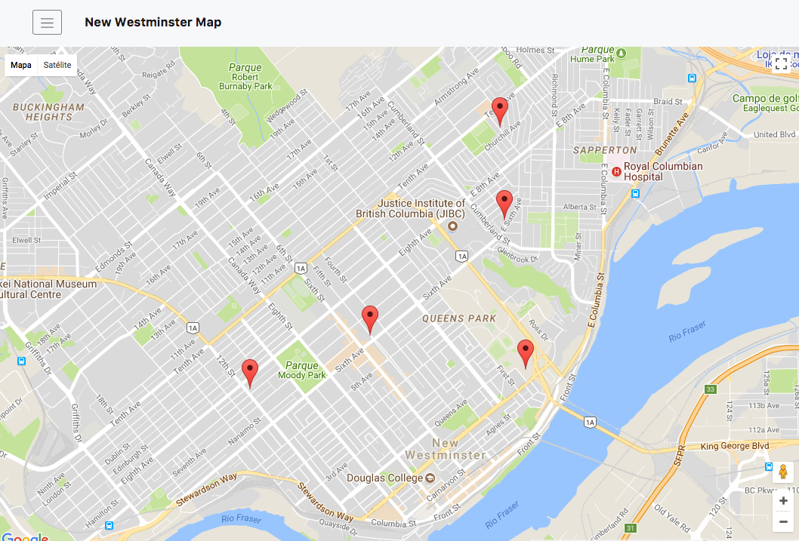
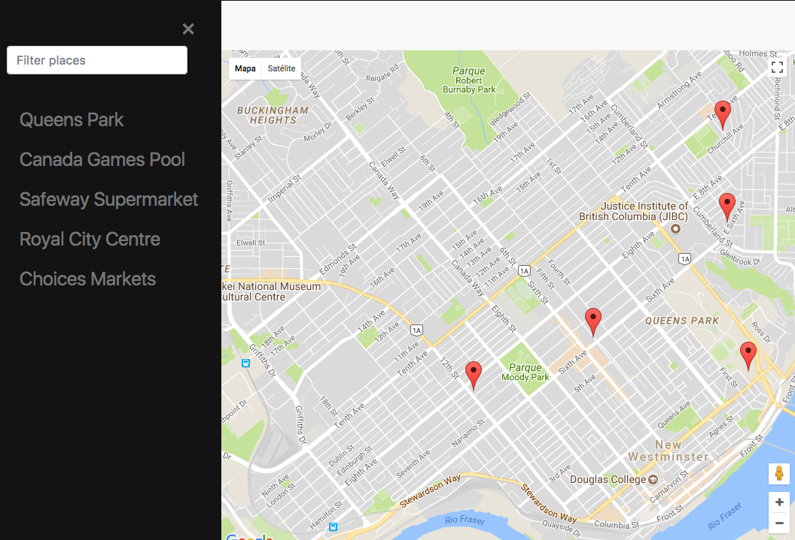
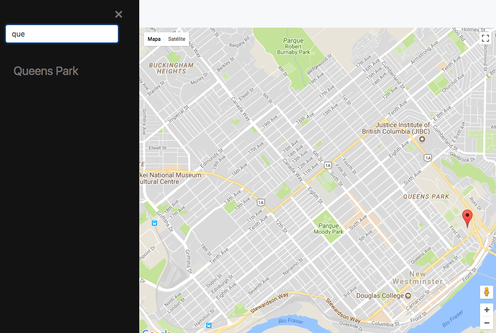
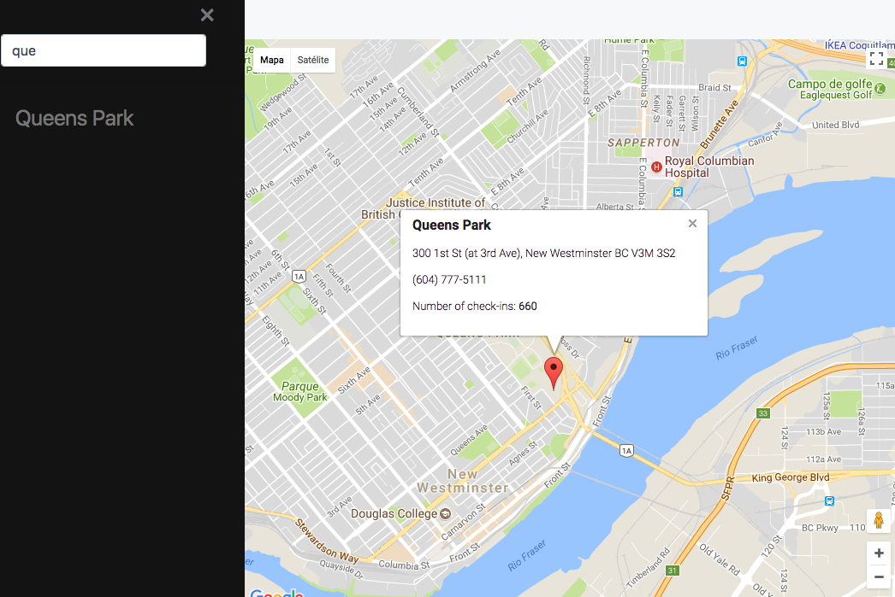

# Neighbourhood Map Project

This is a project from Udacity Front End Nanodegree, for studying purposes.

#### To open the map:
* Download this git repository to your computer
* Open your terminal and navigate to the downloaded folder
* Execute `bower install` to install the dependencies (if you don't have it, you can follow the instructions on https://bower.io/)
* Run a local server on a 8080 port (e.g. `http-server .`)
* On your browser, go to the page: http://localhost:8080

#### Usage:

The map has 5 predefined interest places near Victoria Hill, New Westminster, BC, Canada.

    

To find an specific place, you can filter the map.
To open the filter, click the Menu icon in the top left. A list and an input text box will appear.

    

Write the name of the place you're looking for and the list will be filtered.

    

Once you find it, you can click in the name on the list and it will open a box in the map with some information about the venue.

    

You can also click directly in the pins on the map to obtain information about the place.
